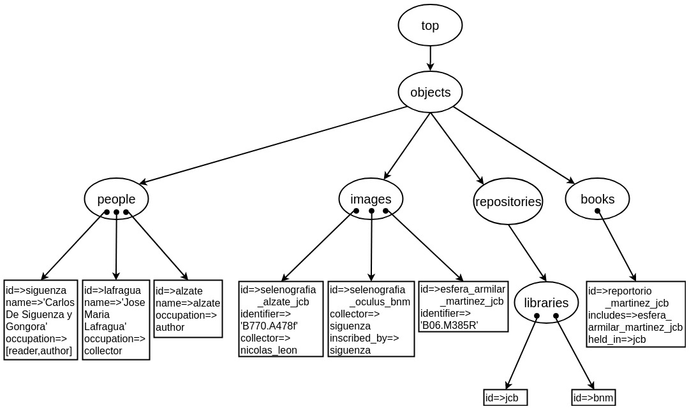
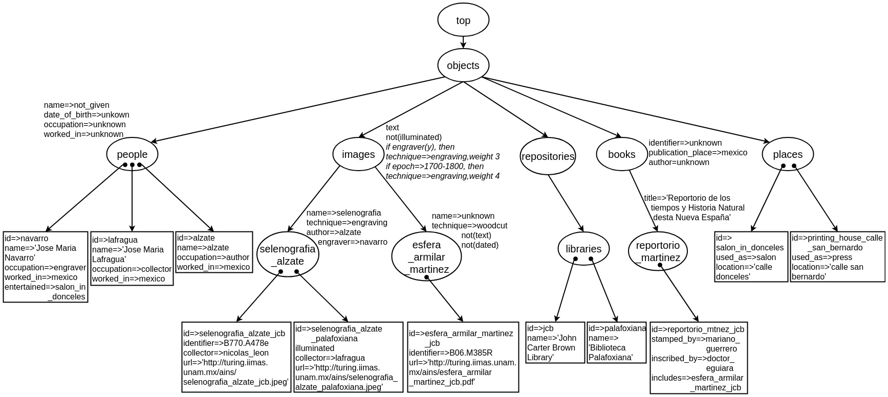

### Astronomical Images of New Spain (AINS)

The structure for the initial taxonomy corresponding to `kb_ains_initial.txt` is depicted next:



The session starts by calling the Prolog interpreter with the instruction `swipl` in a terminal opened in this project folder `non-monotonic-KBS-for-DH/ains_taxonomy/`. The KB engine is loaded with the command:

```?- consult('../kb_engine.pl').```

---
**Note**: In the example code shown here there is a line break between each KB-Service call, which should not be present in the actual execution.

With the sequence of KB-Services presented below the `kb_ains_initial.txt` is updated by adding the image `selenografia_alzate_palafoxiana` with its id, its collector and the fact that it comes illuminated. Also the class `places`  is added with `salon_en_donceles` as its individual. And the id of `selenografia_alzate_jcb` is ammended. Notice how each modification is saved in a variable holding the current state of the KB. Finally, the updated KB is saved as `kb_ains_initial_2.txt`:

`?- open_kb('kb_ains_initial.txt',KB),`<br />
`add_object(selenografia_alzate_palafoxiana,images,KB,KB1),`<br />
`add_object_property(selenografia_alzate_palafoxiana,illuminated,yes,KB1,KB2),`<br />
`add_object_relation(selenografia_alzate_palafoxiana,collector,lafragua,KB2,KB3),`<br />
`add_class(places,objects,KB3,KB4),add_object(salon_en_donceles,places,KB4,KB5),`<br />
`add_object_property(salon_en_donceles,used_as,salon,KB5,KB6),`<br />
`add_object_property(salon_en_donceles,location,'calle donceles',KB6,KB7),`<br />
`change_value_object_property(selenografia_alzate_jcb,identifier,'B770.A478e',KB7,KB8),`<br />
`save_kb('kb_ains_initial_2.txt',KB8).`

Next, the class `selenografia_alzate` is added to `kb_ains_initial_2.txt` and a reassignment of the objects in the class `images` takes place, ending up with the KB `kb_ains_initial_3.txt`. The following commands carry out these modifications:

`?- open_kb('kb_ains_initial_2.txt',KB),`<br />
`add_class(selenografia_alzate,images,KB,KB2),`<br />
`change_object_class(selenografia_alzate_palafoxiana, selenografia_alzate,KB2,KB3),`<br />
`change_object_class(selenografia_alzate_jcb,selenografia_alzate,KB3,KB4),`<br />
`save_kb('kb_ains_initial_3.txt',KB4).`

Custom queries allow the retrival of specific information important for developers and final users of a particular KB application. In the current case-study, the custom queries for Astronomical Images of New Spain are defined in the file `cust_queries_ains.pl`. One of such queries lists all images in the taxonomy according to the commands shown next:

`?- consult('cust_queries_ains.pl').`<br /><br />
`?- open_kb('kb_ains_initial_3.txt',KB),`<br />
`extension_all_images(KB,Extension).`

The answer with all images in the KB `kb_ains_initial_3.txt` is: 

`Extension = [esfera_armilar_martinez_jcb,selenografia_oculus_bnm, selenografia_alzate_jcb,selenografia_alzate_palafoxiana].`

---
After all the research work is completed, the resulting KB for the case-study on Astronomical Images of New Spain can be seen at `kb_ains_final.txt`, whose partial digram appears below.



---
Some of the images described in this case-study can be found at [http://turing.iimas.unam.mx/ains/](http://turing.iimas.unam.mx/ains/)
