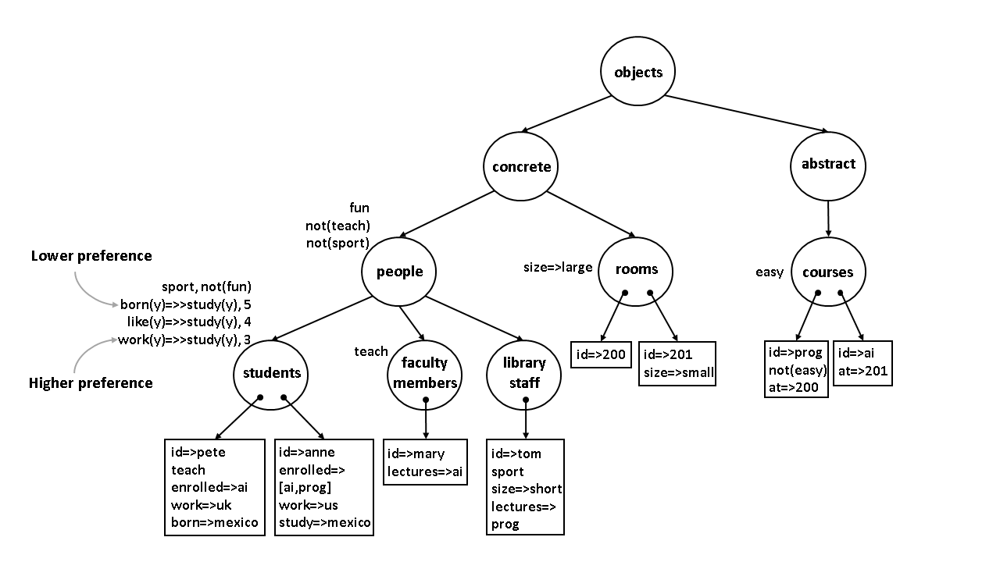

### University Taxonomy

The initial taxonomy of a university is specified in [`kb_university.txt`.](https://github.com/KBS-Lab-IIMAS-UNAM/non-monotonic-KBS-for-DH/blob/master/university_taxonomy/kb_university.txt) Its structure is depicted next:



The session starts by calling the Prolog interpreter with the instruction `swipl` in a terminal opened in this project folder `non-monotonic-KBS-for-DH/university_taxonomy/`. The KB engine is loaded with the command:

```?- consult('../kb_engine.pl').```

---
**Note**: In the example code shown here there is a line break between each KB-Service call, which should not be present in the actual execution.

Examples are provided for each of the eight basic KB-Services present in the system.

1. Return the extension of a class:

`?- open_kb('kb_university.txt',KB),`<br />
   `class_extension(abstract,KB,Extension_Class).`
   
**Answer:** `Extension_Clas = [prog,ai].`

(i.e., all individuals within the class *abstract*).

2. Return the extension of a property:

`?- open_kb('kb_university.txt',KB),`<br />
   `property_extension(study,KB,Extension_Property).`
   
**Answer:** `Extension_Property = = [pete:uk,anne:mexico].`

(i.e., all individuals that have the property *study*).

3. Return the extension of a relation:

`?- open_kb('kb_university.txt',KB),`<br />
   `relation_extension(lectures,KB,Extension_Relation).`

**Answer:** `Extension_Relation = [mary:[ai],tom:[prog]].`

(i.e., all individuals that are related to *lectures*).

4. Return the extension of an explanation:

`?- open_kb('kb_university.txt',KB),`<br />
   `explanation_extension(study=>uk,KB,Extension_Explanation).`
   
   
**Answer:** `Extension_Explanation = [pete:(work=>uk)].`

(i.e., all individuals that have the property *study=>uk*).

5. Return the classes of an individual:

`?- open_kb('kb_university.txt',KB),`<br />
   `classes_of_individual(mary,KB,Classes_of).`
   
**Answer:** `Classes_of = ['faculty members',people,concrete,objects,top].`

(i.e., all classes of  *mary*).

6. Return the properties of an individual:

`?- open_kb('kb_university.txt',KB),`<br />
   `properties_of_individual(tom,KB,Properties_Of).`
   
**Answer:** `Properties_of = [sport,size=>short,fun,not(teach)].`

(i.e., all properties of  *tom*).

7. Return the relations of an individual:

`?- open_kb('kb_university.txt',KB),`<br />
   `relations_of_individual(pete,KB,Relations_Of).`

**Answer:** `Relations_Of = [enrolled=>[ai]].`

(i.e., all relations of  *pete*).

8. Return the explanations of an individual:

`?- open_kb('kb_university.txt',KB),`<br />
  `explanation_of_individual(anne,KB,Explanation_Of).`

**Answer:** `Explanation_Of = [(study=>mexico):(work=>mexico)].`

(i.e., all explanations of  *anne*).

---
Custom queries for retriving specific information of the university KB are defined in [`cust_queries_univ.pl`](https://github.com/KBS-Lab-IIMAS-UNAM/non-monotonic-KBS-for-DH/blob/master/university_taxonomy/cust_queries_univ.pl). Inside the session where the KB system is currently active, two custom queries for the university taxonomy are carried out next.

First, load the file with the custom queries: `?- consult('cust_queries_univ.pl').`

1. Return the students attending a course:

`?- open_kb('kb_university.txt',KB),`<br />
   `students_course(ai,KB,Students_at_Course).`
   
**Answer:** `Students_at_Course = [pete,anne].`

(i.e., all students attending the course *ai*).

2. Return the rooms not assigned to courses:

`?- open_kb('kb_university.txt',KB),`<br />
   `available_rooms(KB,Rooms_Available).`
   
**Answer:** `Rooms_Available = [].`

(i.e., there is no *room* not assigned to courses).

---
Through the KB-Service the content of the KB can be updated, added, removed and chaged. Below there are some examples of these services applied to the KB in [`kb_university.txt`](https://github.com/KBS-Lab-IIMAS-UNAM/non-monotonic-KBS-for-DH/blob/master/university_taxonomy/kb_university.txt). 

Suppose that the class `teaching assistants` is added as a subclass of `people`. The new class has the property that its individuals `teach` and `grade` The items that they grade are: `quizzes`, `projects` and `problem sets`. Also, teaching assistants gather in the `teachers_room`. These modifications are expressed below, where the whole KB is the argument to the modifying predicates. The KB that results of this additions is saved as `kb_add_class.txt`:

`?- open_kb('kb_university.txt',KB),`<br />
`add_class('teaching assistants',people,KB,KB1),`<br />
`add_class_property('teaching assistants',teach,yes,KB1,KB2),`<br />
`add_class_property('teaching assistants',grade,[quizzes,projects,'problem sets'],KB2,KB3),`<br />
`add_class_relation('teaching assistants',found,teachers_room,KB3,KB4),`<br />
`save_kb('kb_add_class.txt',KB4).`

Now, the individual `john` is added to the class teaching assistants -- just created. A property and a relation are defined for him: john is a `sport` person and `works` for `mary`. Also the `teachers_room` is added as an individual to the class `rooms`. These additions are saved as `kb_add_obj.txt`. The procedure is as follows:

`?- open_kb('kb_add_class.txt',KB),`<br />
`add_object(john,'teaching assistants',KB,KB1),`<br />
`add_object_property(john,sport,yes,KB1,KB2),`<br />
`add_object_relation(john,works_for,mary,KB2,KB3),`<br />
`add_object(teachers_room,rooms,KB3,KB4),`<br />
`save_kb('kb_add_obj.txt',KB4).`

Next, the class `library staff` is removed, as well as the individual `pete` within the class `student`. The resulting KB is saved as `kb_rm.txt`:

`?- open_kb('kb_add_obj.txt',KB),`<br />
`rm_class('library staff',KB,KB1),`<br />
`rm_object(pete,KB1,KB2),`<br />
`save_kb('kb_rm.txt',KB2).`

The value of the property `size` of the class `rooms` is updated, and the default value of this property is now `huge`; the name `john` is changed to `brian`, and the object of the relation `lectures` of `mary` is updated to `prog`. This changes are saved as `kb_change.txt`:

`?- open_kb('kb_rm.txt',KB),`<br />
`change_value_class_property(rooms,size,huge,KB,KB1),`<br />
`change_object_name(john,brian,KB1,KB2),`<br />
`change_value_object_relation(mary,lectures,prog,KB2,KB3),`<br />
`save_kb('kb_change.txt',KB3).`

Finally, the weigh of a preference is updated:

`?- open_kb('kb_change.txt',KB),`<br />
`change_weight_class_property_preference(students,like=>'-'=>>study=>'-',7,KB,KB1),`<br />
`save_kb('kb_preference_university.txt',KB1).`

At the end, the file with the final state of the KB for the university taxonomy is [`kb_preference_university.txt`](https://github.com/KBS-Lab-IIMAS-UNAM/non-monotonic-KBS-for-DH/blob/master/university_taxonomy/kb_preference_university.txt).
